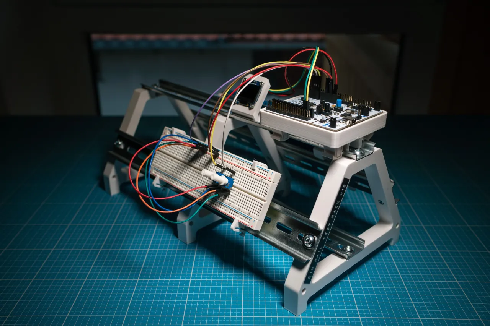
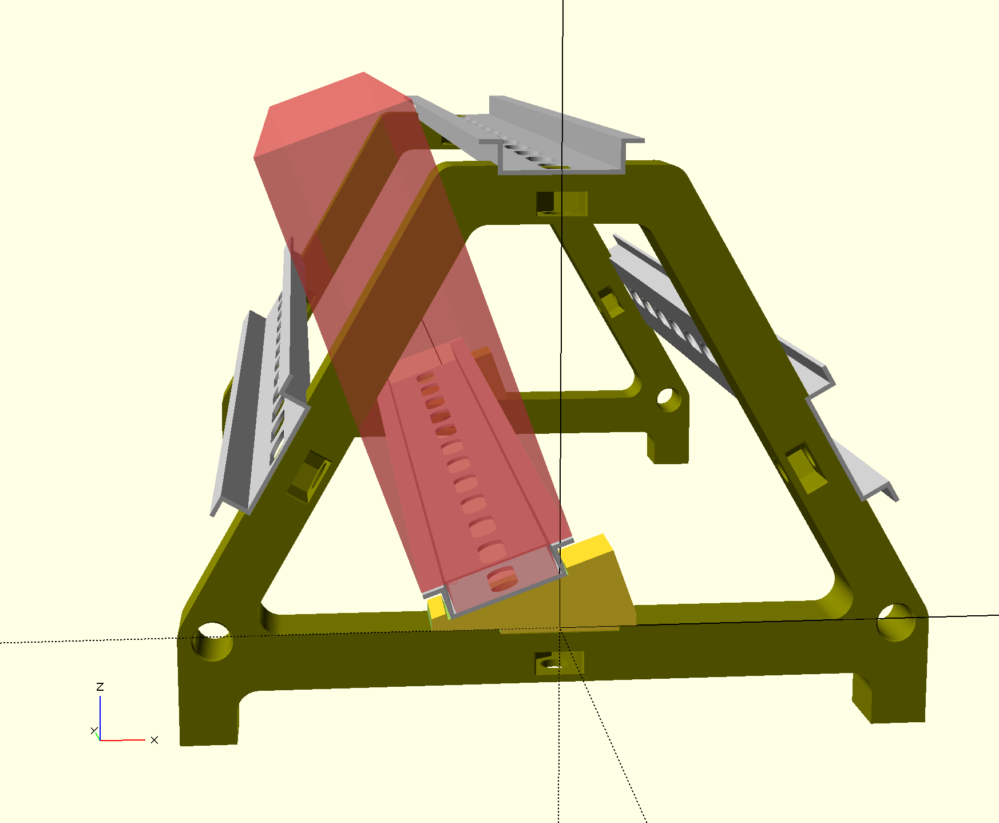

# Wedge to Modify 3D Printed DIN Rail Test Stand

### Background

As seen in the picture below, user PlasticXYZ made a clever DIN rail
test stand for benchtop use in the lab. Their design files are available
at Printables (_see link at the bottom, image from PlasticXYZ_).

I printed and assembled my test rack using 500 mm pre-cut lengths of DIN rail.
Since the bottom rail is a little hard to access, I planned to put terminal blocks on that rail.
These would be used for power distribution and rarely need to be accessed.

### Problem

Unfortunately, things mounted on the bottom rail are very hard to access by screwdriver, 
because the top rail blocks access. I decided to modify the design slightly and put the bottom rail at a
slight angle, thus allowing easier access. After poking around in
OpenSCAD, the magic angle works out to be 20 degrees. As depicted by 
the big orange cube the sketch, this should be perfect.

<!-- 

-->

### Solution

The original source files aren't available, so I decided not to try to
reconstruct the triangular brackets. That would have also required
re-printing them, a non-trivial amount of time for such a small change.
Instead, I made a small wedge-shaped piece that holds the bottom rail at
the 20 degree angle and attaches to the brackets as originally designed.

Since the wedge needs to be small, I couldn't use the captive square nut
approach as Plastic XYZ did. Instead, I used M5 threaded brass inserts,
which I pressed into the wedge after printing. 

**NOTE:** This modification is still underway. I will post photos later of the finished product. 

### Files

* `din-fixture.scad` Contains the wedge and a render of the entire assembly.
* `din-fixture-wedge.stl` Wedge STL file
* `din-test-fixture-triangle-support.stl` Original bracket STL file from PlasticXYZ

### Printables link to PlasticXYZ's design:

[https://www.printables.com/model/150786-din-rail-test-rack](https://www.printables.com/model/150786-din-rail-test-rack/comments)
